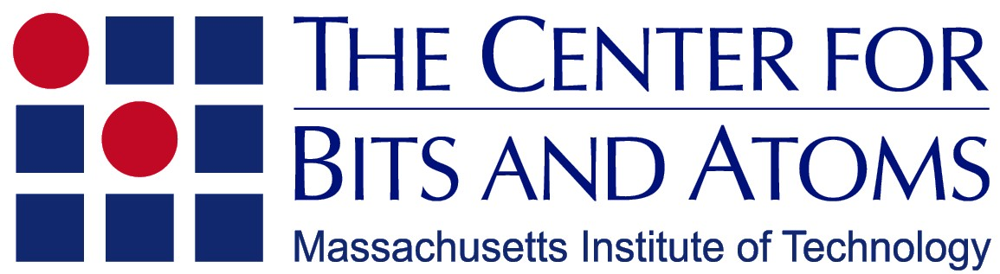

# The Lab Fab Project

### _Open-source scientific instrumentation design portal   for sustainable (bio)materials research_

The Lab Fab project is an effort between our lab, The Autonomous Science Lab at NCSR Demokritos in Greece and The Center for Bits and Atoms at MIT to create an onlide portal of open designs of modular, low-cost, automation-ready scientrific instrumentation for autonomous science research in the field of sustanainable (bio)materials. 

⭐ If you find value in this project, **give it a star** to help others discover it too

---

## 💎 Sponsors

<em>
Support from our sponsors helps make this project possible. 

</em>

<!-- ─────────── 1st row – 1 sponsor ─────────── -->
<table align="center" cellpadding="20"
       style="table-layout:fixed; width:100%; border-collapse:collapse;">
<tr align="center" valign="top">

  <!-- EU RRF -->
  <td width="600" >
     

  </td>

</table>

---

## 💎 Collaborators

<em>
Support from our partners helps make this project possible. 

</em>

<!-- ─────────── 1st row – 1 collaborator ─────────── -->
<table align="center" cellpadding="20"
       style="table-layout:fixed; width:100%; border-collapse:collapse;">
<tr align="center" valign="top">

  <!-- CBA -->
  <td width="800" >
     

  </td>

</table>

---

## ✨ Introduction
 Low-cost hardware infrastructure has been a bottleneck to the democratization of self-driving labs and autonomous physical experimentation in the field of sustainable (bio)materials research. **The Lab Fab Project** is trying to solve that by providing open digital designs to some of the building blocks of possible self-driving (bio)materials engineering labs.This is a work in progress and we invite you to start remixing and building in parallel with us.

  

---

## 🔑 Key Features

| **Reproducibility** | **Validation** |
|---|---|
| We publish each instrument with a detailed BOM covering off-the-shelf and custom components, vendors, CAD models, manufacturing drawings, and self-explanatory assembly instructions. | The project focuses on digital designs, but selected testing and validation results will also be published. |

---

## 📚 Open Designs

### 🔩 Building Blocks & Accessories

<table width="100%">
  <tr style="background-color:#f8f9fa">
    <th width="30%">Design</th>
    <th width="0%">Description</th>
    <th width="10%">View</th>
    <th width="10%">View</th>
    <th width="10%">Coming Soon</th>

  </tr>
  <tr>
    <td> 🔌 superBoards</td>
    <td>ESP 32 PCB boards for networked modular instrumentation control.</td>
    <td align="center">
      
    </td>
    <td align="center">
      
    </td>
        <td align="center">
      
    </td>
    <tr>
    <td> 💻 superNodes </td>
    <td>Visual programming canvas for instrumentation control and orchetration using nodes.</td>
    <td align="center">
      
    </td>
    <td align="center">
      
    </td>
    </td>
        <td align="center">
      
    </td>
    <tr>
    <td>Enclosures</td>
    <td>Sturdy sheet metal enclosures at variable sizes for instrumentation.</td>
    <td align="center">
      
    </td>
    <td align="center">
      
    </td>
    </td>
        <td align="center">
      
    </td>
    <tr>
    <td>Kinematic Couplings</td>
    <td>Tool integration mechanism for reproducible and precise mounting of printing tools & instruments without screws and integrated load cell-based zeroing mechanism.</td>
    <td align="center">
      
    </td>
    <td align="center">
      
    </td>
    </td>
        <td align="center">
      
    </td>
    <tr>
    <td>USB U-Scope Camera</td>
    <td>Customized and integration-ready USB u-scope camera with kinematic couplings and motorized zoom/focus.</td>
    <td align="center">
      
    </td>
    <td align="center">
      
    </td>
    </td>
        <td align="center">
      
    </td>
    <tr>
    <td>3-Axis Cartesian Motion System</td>
    <td>XYZ motion system with upgraded open builds-style leadscrew driven axes.</td>
    <td align="center">
      
    </td>
    <td align="center">
      
    </td>
    </td>
        <td align="center">
      
    </td>
    <tr>
    <td>2-Axis High Resolution Motion Stage</td>
    <td>50 mm -XY motion stage with micron positioning accuracy.</td>
    <td align="center">
      
    </td>
    <td align="center">
      
    </td>
    </td>
        <td align="center">
      
    </td>
    <tr>
    <td>2-Axis High Resolution Motion Stage</td>
    <td>25 mm - XY motion stage with micron positioning accuracy.</td>
    <td align="center">
      
    </td>
    <td align="center">
      
    </td>
    </td>
        <td align="center">
      
    </td>
    <tr>
    <td>2-Axis nm Piezo Motion Stage</td>
    <td>XY motion stage with nano positioning accuracy.</td>
    <td align="center">
      
    </td>
    <td align="center">
      
    </td>
    </td>
        <td align="center">
      
    </td>
  </tr>
</table>

### 🧪 Synthesis Instrumentation

<table width="100%">
  <tr style="background-color:#f8f9fa">
    <th width="30%">Design</th>
    <th width="0%">Description</th>
    <th width="10%">View</th>
    <th width="10%">View</th>
    <th width="10%">View</th>
  </tr>
  <tr>
    <td>Automated Powder Dispenser</td>
    <td>Automated powder dispensing based on the Archimedes principle.</td>
    <td align="center">
      
    </td>
    <td align="center">
      
    </td>
        <td align="center">
      
    </td>
    <tr>

  </tr>
</table>

### ✂️ Processing Instrumentation

<table width="100%">
  <tr style="background-color:#f8f9fa">
    <th width="30%">Design</th>
    <th width="0%">Description</th>
    <th width="10%">View</th>
    <th width="10%">View</th>
    <th width="10%">View</th>
  </tr>
  <tr>
    <tr>
    <td>Hybrid Manufacturing </td>
    <td>Router with automatic tool-change for cutting & 3d printing.</td>
    <td align="center">
      
    </td>
    <td align="center">
      
    </td>
        <td align="center">
      
    </td>
    <tr>
    <td>Direct Ink Writing</td>
    <td>Pneumatic extrusion of soft materials.</td>
    <td align="center">
      
    </td>
    <td align="center">
      
    </td>
    </td>
        <td align="center">
      
    </td>
    <tr>
    <td>FDM Printer</td>
    <td>Fused filament fabrication system with online metrology.</td>
    <td align="center">
      
    </td>
    <td align="center">
      
    </td>
    </td>
        <td align="center">
      
    </td>
  </tr>
</table>

### 🔍 Characterization Instrumentation

<table width="100%">
  <tr style="background-color:#f8f9fa">
    <th width="30%">Design</th>
    <th width="0%">Description</th>
    <th width="10%">View</th>
    <th width="10%">View</th>
    <th width="10%">View</th>
  </tr>
  <tr>
    <td>Micro-Extrusion Rheometer</td>
    <td>Capillary rheometry with online extrudate swell monitoring and lab scale for thermo-responsive soft materials.</td>
    <td align="center">
      
    </td>
    <td align="center">
      
    </td>
        <td align="center">
      
    </td>
    <tr>
    <td>Multi-Tool Rheometer</td>
    <td>Rheometry platform with inter-changeable end effectors for thermo-responsive soft materials .</td>
    <td align="center">
      
    </td>
    <td align="center">
      
    </td>
        <td align="center">
      
    </td>
    <tr>
    <td>Scanning Upright Optical U-Scope </td>
    <td>3-axis Cartesian motion + 2-axis high res stage + motorized USB u-scope camera on kinematic coupling</td>
    <td align="center">
      
    </td>
    <td align="center">
      
    </td>
        <td align="center">
      
    </td>
    <tr>
    <td>Scanning Upright Molecular U-Scope </td>
    <td>3-axis Cartesian motion + 2-axis high res stage + motorized USB u-scope camera on kinematic coupling + Raman</td>
    <td align="center">
      
    </td>
    <td align="center">
      
    </td>
        <td align="center">
      
    </td>
  </tr>
</table>

 

 

## ✨ To DOs 

