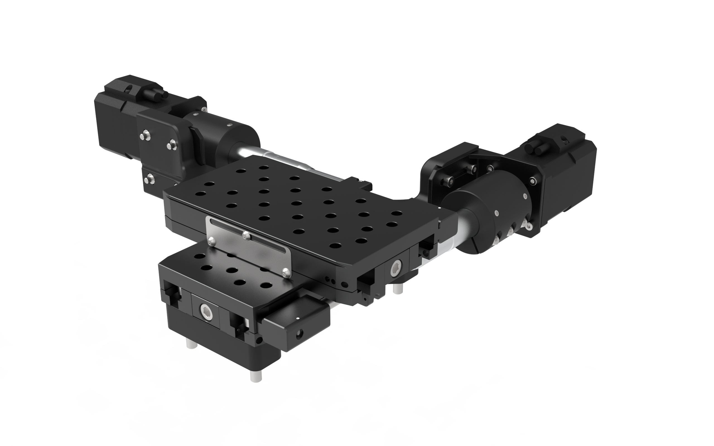
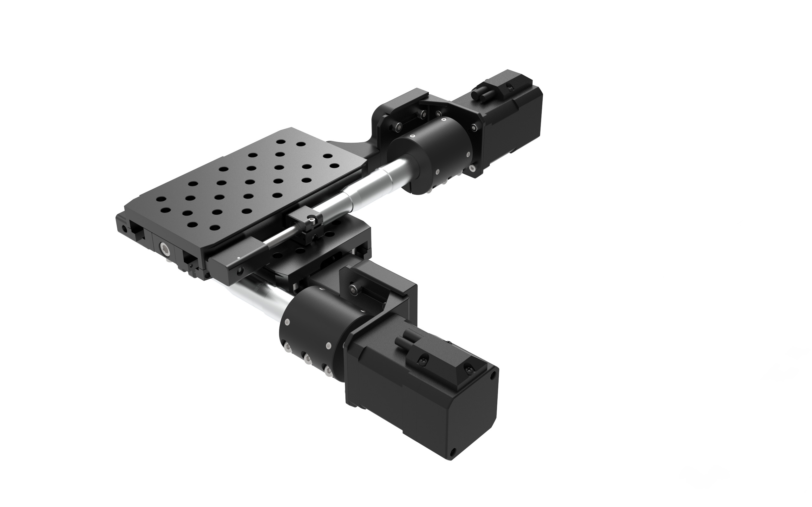
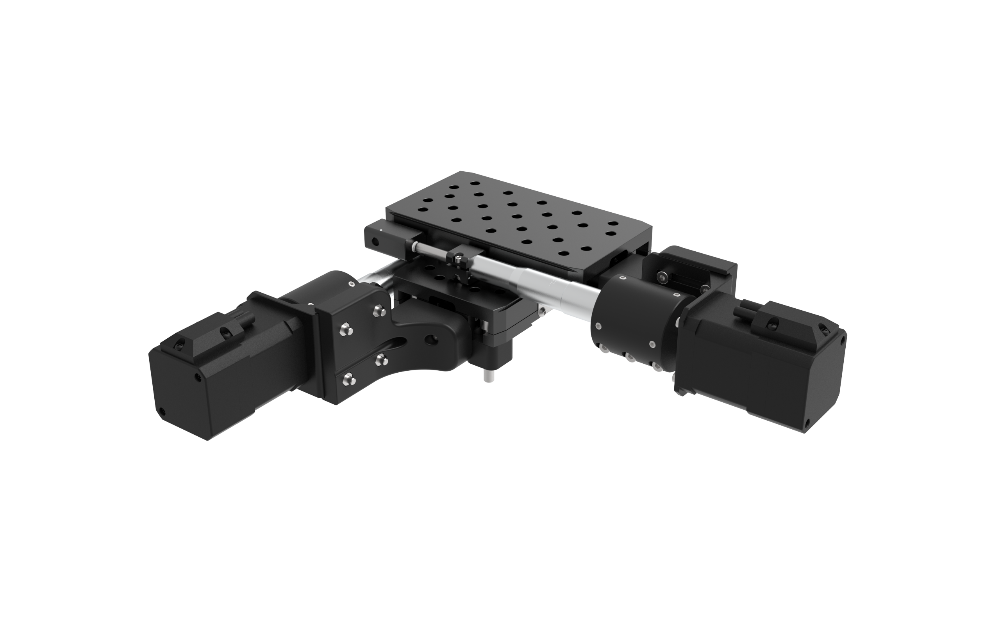
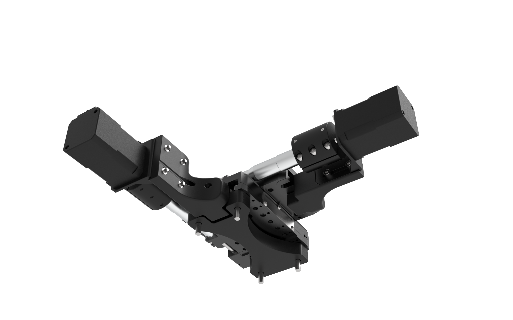

# 2-Axis High Resolution Stage

### Bill of Materials: [LINK](https://docs.google.com/spreadsheets/d/1ZzZBuDDhAdsVGXvjnOKZjG3D2ScVzXgC/edit?usp=sharing&ouid=117211680970331461084&rtpof=true&sd=true)

- CAD Files: [LINK](https://drive.google.com/drive/folders/1P9JbpCmvGTudBLSs0YrZ8bzVMgzwHQVR?usp=drive_link) 

- Assembly Drawings: [LINK](https://drive.google.com/drive/folders/1P9JbpCmvGTudBLSs0YrZ8bzVMgzwHQVR?usp=drive_link)

- Assembly Instructions: [LINK](https://drive.google.com/drive/folders/1P9JbpCmvGTudBLSs0YrZ8bzVMgzwHQVR?usp=drive_link) Not Ready Yet

- Parts for 3D Printing: [LINK](https://drive.google.com/drive/folders/1P9JbpCmvGTudBLSs0YrZ8bzVMgzwHQVR?usp=drive_link)

- Parts for Machining: N/A

- Parts for Sheet Metal Manufacturing: N/A

 

 

