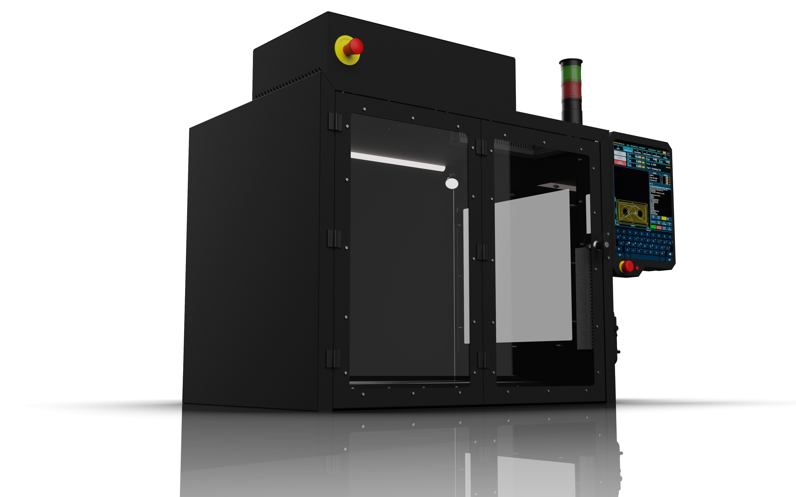
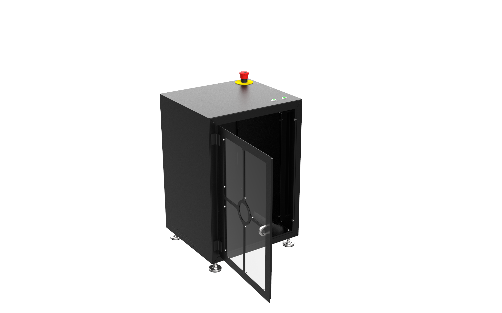

# Enclosures

## CNC Enclosure

### Bill of Materials: [LINK](https://docs.google.com/spreadsheets/d/1xUV5Pukq3TdfwHtZCYd1vhdXzHqn_hqu/edit?usp=drive_link&ouid=117211680970331461084&rtpof=true&sd=true)

- CAD Files: [LINK](https://drive.google.com/drive/folders/1E_d7PVIV2T-837XEQrYmD6py8O0hjTft?usp=sharing) 

- Assembly Drawings: [LINK](https://drive.google.com/drive/folders/1E_d7PVIV2T-837XEQrYmD6py8O0hjTft?usp=sharing)

- Assembly Instructions: [LINK](https://drive.google.com/drive/folders/1E_d7PVIV2T-837XEQrYmD6py8O0hjTft?usp=sharing) - Not Ready Yet

- Parts for 3D Printing: [LINK](https://drive.google.com/drive/folders/1mptDLOyFeRbZQm_EgxlMNko0YaPM-R54?usp=sharing)

- Parts for Machining: N/A

- Parts for Sheet Metal Manufacturing: [LINK](https://drive.google.com/drive/folders/1E_d7PVIV2T-837XEQrYmD6py8O0hjTft?usp=sharing)

## Instrument Enclosure : 300x350x436 mm

### Bill of Materials: [LINK](https://docs.google.com/spreadsheets/d/1Q8AmqQMvhWWuM36SRXCvJduGekH38Bv9/edit?usp=sharing&ouid=117211680970331461084&rtpof=true&sd=true)

- CAD Files: [LINK](https://drive.google.com/drive/folders/1kdYdW1-TRiwsKC1_uCnRhj_nQOIf5S2H?usp=sharing) 

- Assembly Drawings: [LINK](https://drive.google.com/drive/folders/1kdYdW1-TRiwsKC1_uCnRhj_nQOIf5S2H?usp=sharing)

- Assembly Instructions: [LINK](https://drive.google.com/drive/folders/1kdYdW1-TRiwsKC1_uCnRhj_nQOIf5S2H?usp=sharing) - Not Ready Yet

- Parts for 3D Printing: N/A

- Parts for Machining: N/A

- Parts for Sheet Metal Manufacturing: [LINK](https://drive.google.com/drive/folders/1kdYdW1-TRiwsKC1_uCnRhj_nQOIf5S2H?usp=sharing)

## Instrument Enclosure : 300x350x526 mm

### Bill of Materials: [LINK](https://docs.google.com/spreadsheets/d/1yuVGMakCY-ht8755YdrSe2WnM3jnKTf8/edit?usp=sharing&ouid=117211680970331461084&rtpof=true&sd=true)

- CAD Files: [LINK](https://drive.google.com/drive/folders/1QCUq_ne5gC2F5A4PGTtzp3YNqQKHvRGP?usp=sharing) 

- Assembly Drawings: [LINK](https://drive.google.com/drive/folders/1QCUq_ne5gC2F5A4PGTtzp3YNqQKHvRGP?usp=sharing)

- Assembly Instructions: [LINK](https://drive.google.com/drive/folders/1QCUq_ne5gC2F5A4PGTtzp3YNqQKHvRGP?usp=sharing) - Not Ready Yet

- Parts for 3D Printing: N/A

- Parts for Machining: N/A

- Parts for Sheet Metal Manufacturing: [LINK](https://drive.google.com/drive/folders/1QCUq_ne5gC2F5A4PGTtzp3YNqQKHvRGP?usp=sharing)

