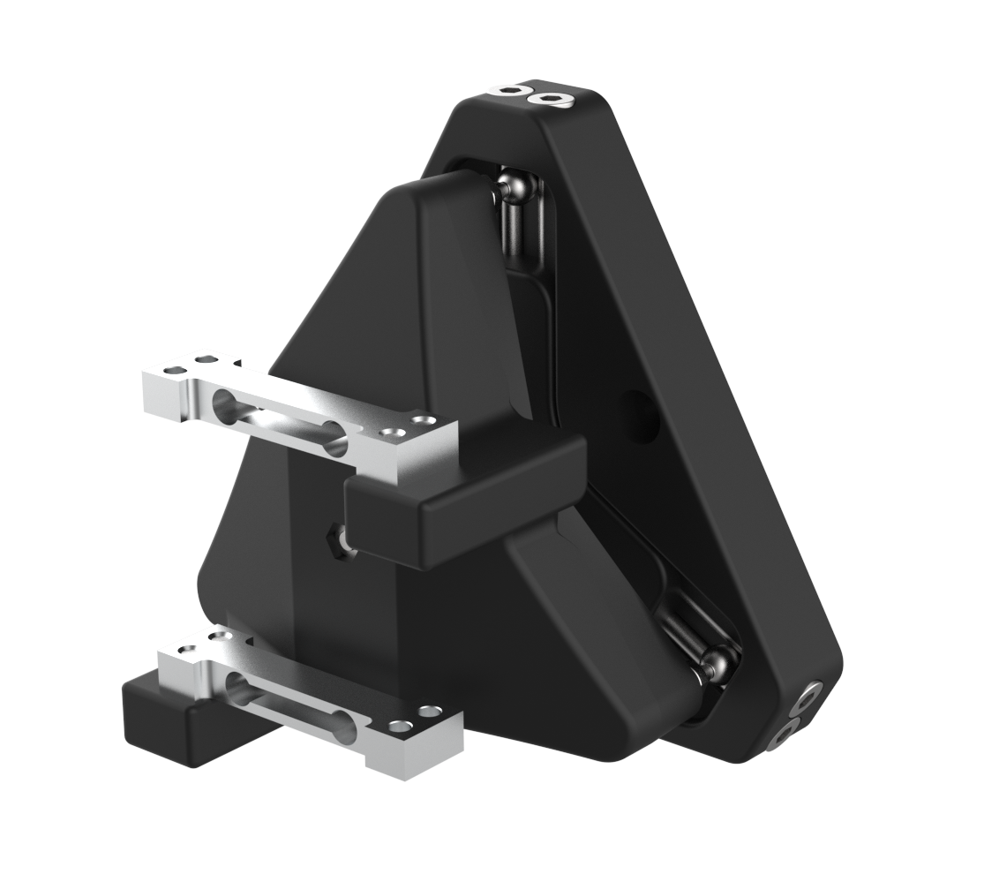

# Kinematic Couplings

## For Printing Tools & Instrument Heads

### Bill of Materials: [LINK](https://docs.google.com/spreadsheets/d/127P18W2pBcggpg_53cgIRUALYT_M43Az/edit?usp=drive_link&ouid=117211680970331461084&rtpof=true&sd=true)

- CAD Files: [LINK](https://drive.google.com/drive/folders/1MTiggVTdh-cBFWFTP-dkPh0iErF2u9bk?usp=drive_link) 

- Assembly Drawings: [LINK](https://drive.google.com/drive/folders/1MTiggVTdh-cBFWFTP-dkPh0iErF2u9bk?usp=drive_link)

- Assembly Instructions: [LINK](https://drive.google.com/drive/folders/1MTiggVTdh-cBFWFTP-dkPh0iErF2u9bk?usp=drive_link) - Not Ready Yet

- Parts for 3D Printing: [LINK](https://drive.google.com/drive/folders/1MTiggVTdh-cBFWFTP-dkPh0iErF2u9bk?usp=drive_link)

- Parts for Machining: N/A

- Parts for Sheet Metal Manufacturing: N/A

