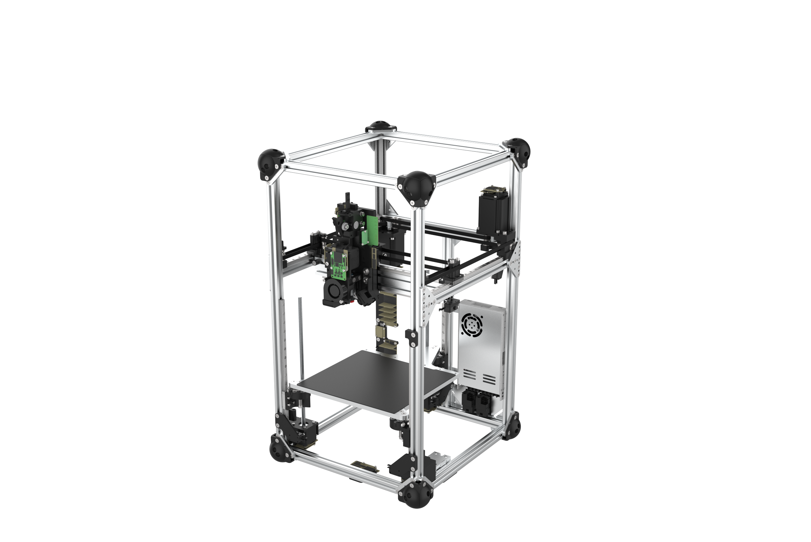

# FDM Printer with online metrology

### Bill of Materials: [LINK](...)

- CAD Files: [LINK](https://drive.google.com/drive/folders/174Hv-n6-VdfiQ5vrCtNUJMMXhvrRIZsq?usp=drive_link) 

- Assembly Drawings: [LINK](...)

- Assembly Instructions: [LINK](...) 

- Parts for 3D Printing: [LINK](...)

- Parts for Machining: [LINK](...)

- Parts for Sheet Metal Manufacturing: [LINK](...)

 

 

