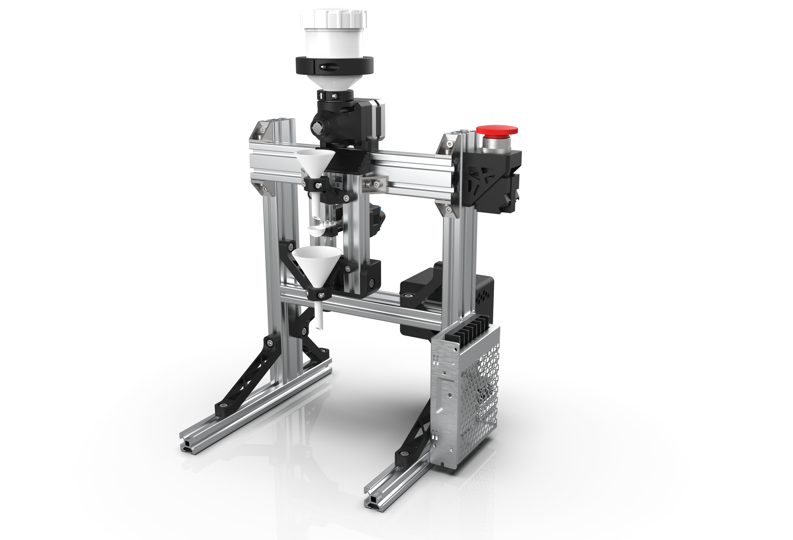

# Automated Powder Dispenser

### Bill of Materials: [LINK](https://docs.google.com/spreadsheets/d/1n3sP2zOxDwd-T-xdCsopa9e-FSXx7yVM/edit?usp=drive_link&ouid=117211680970331461084&rtpof=true&sd=true)

- CAD Files: [LINK](https://drive.google.com/drive/folders/1NxMb5GZngzrFfSzFjc_bbhfiGpZ7EZ4r?usp=drive_link) 

- Assembly Drawings: [LINK](https://drive.google.com/drive/folders/1NxMb5GZngzrFfSzFjc_bbhfiGpZ7EZ4r?usp=drive_link)

- Assembly Instructions: [LINK](https://drive.google.com/drive/folders/1NxMb5GZngzrFfSzFjc_bbhfiGpZ7EZ4r?usp=drive_link) 

- Parts for 3D Printing: [LINK](https://drive.google.com/drive/folders/1NxMb5GZngzrFfSzFjc_bbhfiGpZ7EZ4r?usp=drive_link)

- Parts for Machining: N/A

- Parts for Sheet Metal Manufacturing: N/A

The system can be mounted within an eclosure: [LINK](https://drive.google.com/drive/folders/17UJ4I3CEe4JMZR2c-dJ6OrnTzk4Yyab-?usp=drive_link)

 

 

